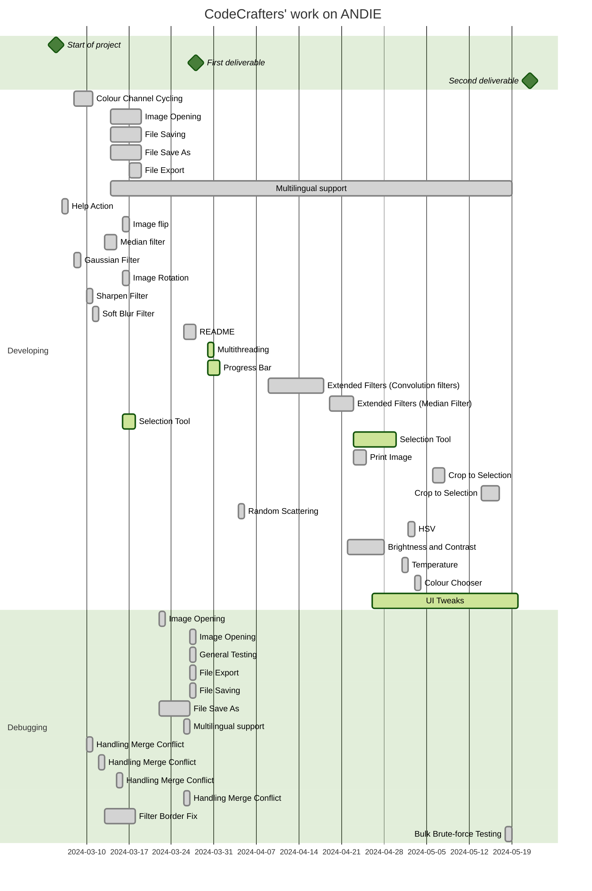

<h2>
 ANDIE - A Non-Destructive Image Editor

Made by the CodeCrafters Team

ANDIE Code Crafters © 2024 by Emma Boult, Eden Li, Angus Lyall, Kevin Sathyanath, Yuxing Zhang is licensed under CC BY-NC-SA 4.0

</h2>

## Contribution
`Eden`
* Image export
* Improved Save function
* Improved Save as function
* Improved File Opening function
* Improved File Exit function
* Colour Channel Cycling
* Error Handling (yes with funny messages)
* Adding Traditional Chinese (Taiwan) language support
* Created the icon
* Implemented multithreading for median filter
* Added two types of keyboard hotkeys for MacOS and Windows and their instructions
* Print Image
* ToolBar (and its icons)
* Theme Change for MacOS and Windows (big sorry for Linux)
* Implemented Selection Box with Emma

`Kevin`
* Enabled Multilingual support
* Image flip (Horizontal and Vertical)
* Median filter
* Image rotation - polishing
* Image invert (Worked with Yuxing)
* Added Bahasa Indonesia as language option
* Added a Help option and an About Us.
* Testing and debugging
* Added progress bar to random scattering
* Random Scattering
* Added the Brightness and Contrast feature
* Added temperature modification for images
* Added HSV modification feature
* Added Sepia filter
* Added a colour chooser
* Added icons to menus
* Added themes
* Made preview panels for major image operations
* Fixed Javadocs pipeline

`Yuxing`
* Image resize
* Image invert
* Image scaling
* Block averaging
* Drawing functions
* Macros

`Emma`
* Sharpen filter
* Soft blur filter
* Black image border issue fix
* Creating Readme.md
* Testing whole project during runtime for bugs
* Created Issues.txt
* Encapsulation of code to pad border of images - FilterBorder.java
* Extended filters
* Mouse Selection
* Crop to Selection

`Angus`
* Guassian blur filter
* Image rotation
* Testing
* User instuctions read me
* Filters with negative results
* Emboss Filter with edge detection
* Sobel Filter
* Continuous Integration

## Testing
The majority of our testing was done via a brute force method. After each feature was complete we thought of all the scenarios that could occur when a user used said feature and checked for any errors or unexpected outcomes. Once we were completely featured complete, we moved into testing all the different combinations of features available. This allowed us to uncover issues that could occur, particularly with feature that in practice would be commonly used together.
The bulk of our last round of testing was done as an entire group, we booked out a study room for a day and all rigorously tested, trying our best to break our program. This uncovered quite a few errors we had not originally caught, we then noted them all down under the "issues" tab in our Git Lab repository.

Throughout the entirety of our development we had a good system or reporting bugs found in testing. Each time a new bug was found, whoever uncovered it would add it as an "issue" in our Git Lab repository. This way we could all see the complete list of bugs we needed to fix and discuss in the comments on how we planned to fix them. This kept all of our team in the loop and ensured no known bug accidentally got forgotten about.

## Known Issues
- The language support for JColourChooser cannot be implimented. This would be quite tedious and convoulted to fix
- UI is not as harmonious as we would like it to be
- In our menu bar we have implimented icons for main operations, however not every feature has an icon
- There is an error that appears for the preview panel for some of the filters intermittently. It does not appear often enough to debug effectively.

### Previous known issues that have now been fixed
- When the median filter is applied, the outer ring of pixels is effected adversely. As it does not use a convolution, the same method we applied to the other filters to fix this doesn't work. (fixed)
- For the remaining filters, when applied, the image will lose its outer ring of pixels each time they are applied. (fixed)
- When the user opens the dialog to open a different file but then cancels, the selection function will break. (fixed)
- When user is prompted to enter a value for an action, if they exit out of the pop-up, the action will still be performed with the default value. (fixed)

## User Guide

### Installation

⚠️Prerequisites⚠️
- Java Development Kit (JDK): You'll need a recent version of the JDK installed on your system. Download and install it from the official Oracle website: https://www.oracle.com/nz/java/technologies/downloads/. Verify the installation by opening a terminal and running java -version.

- Gradle: Version 8.6
- FlatLaf: Version 3.2  (https://mavenlibs.com/maven/dependency/com.formdev/flatlaf)

🔧Installation🔧
- Clone or Download the Project: Obtain the project files using your preferred method (Git clone or direct download).

🏃Running the program🏃
- Open Terminal and navigate to project directory
- Run `gradle build`
- Run `gradle run`
- To open files, go to file > open

### Using ANDIE

#### Opening Image
    1. Click on ‘File’ in the menu bar
    2. Select ‘Open’
    3. Browse to the image file you want to edit and click ‘Open’

#### Saving Image
    1. Click on ‘File’ in the menu bar
    2. Select ‘Save As’
    3. Choose the location and format for the image and click ‘save’

#### Saving Operations
    1. Click on ‘File’ in the menu bar
    2. Select ‘Save’
    3. A popup will confirm that the .ops file has saved successfully

#### Change Theme
    1. Click on ‘Edit’ in the menu bar
    2. Select ‘Change Theme’
    3. Select which theme you wish to use from the drop down menu and click ‘Ok’
    4. Then restart the application for the new theme to take effect

#### Selection
    1. Click, within the image area, where you would like to start the selection
    2. Drag the mouse until you have the desired selection size
    3. Release the mouse to confirm selection

#### Cropping
    1. Make a selection (see above)
    2. Click on ‘Image’ in the menu bar
    3. Select ‘Crop’

#### Drawing Functions
    1. Click on ‘Drawing’ in the menu bar
    2. Select your desired shape to draw
    3. Select a colour swatch from the colour chooser, then click ‘Ok’

   🔥Hot
keys🔥

<!--https://helpx.adobe.com/tw/photoshop/using/default-keyboard-shortcuts.html-->

| Menus  | Actions                | Windows                | macOS   | Windows & macOS   | Alternative                    |
|--------|------------------------|------------------------|---------|-------------------|--------------------------------|
| **F**ile   | **O**pen              | Ctrl + O               | ⌘ O     | F - O             |                                |
|        | **S**ave              | Ctrl + S               | ⌘ S     | F - S             |                                |
|        | Save **A**s                | Ctrl + Shift + S       | ⇧⌘ S    | F - A             |                                |
|        | **E**xport                 | Ctrl + E               | ⌘ E     | F - E             |                                |
|        | **P**rint                   | Ctrl + P               | ⌘ P     | F - P             |                                   |
|        | **S**et Language               |                        |         | F - L             |                                |
|        | Exit (**Q**)                   | Ctrl + Q               | ⌘ Q     | F - Q             | Alt + F4 (Windows)             |
| **E**dit   | **U**ndo                   | Ctrl + Z               | ⌘ Z     | E - U             |                                |
|        | **R**edo                   | Ctrl + Y               | ⌘ Y     | E - R             | Ctrl/Cmd + Shift + Y (Win/Mac) |
|        | **C**hange Theme              |                       |         | E - C             |                                 |
| **V**iew   | Zoom **i**n                | Ctrl + "+"             | ⌘ +     | V - I             |                                |
|        | Zoom **o**ut               | Ctrl + "-"             | ⌘ -     | V - O             |                                |
|        | Zoom **f**ull              | Ctrl + 0               | ⌘ 0     | V - F             | Ctrl/Cmd + 1 (Win/Mac)         |
| **I**mage  | Flip **H**orizontal        |                        |         | I - H             |                                |
|        | Flip **V**ertical          |                        |         | I - V             |                                |
|        | Crop                       |                        |         |                   |                                |
|        | **R**otate                 |                        |         | I - R             |                                |
|        | R**e**size                 | Ctrl + Alt + I         | ⌥ ⇧ ⌘ I | I - E             |                                |
|        | **S**caling                |                        |         | I - S - 1/2/3/4/5 |                                |
|        | R**o**tate By              |                        |         | I - O - 1/2/3     |                                |
| Fi**l**ter | **M**ean Filter            |                        |         | L - M             |                                |
|        | **S**oft Blur              |                        |         | L - S             |                                |
|        | S**h**arpen Filter         |                        |         | L - H             |                                |
|        | **G**aussian Filter        |                        |         | L - G             |                                |
|        | Me**d**ian Filter          |                        |         | L - D             |                                |
|        | **E**mboss Filter          |                        |         | L - E             |                                |
|        | S**o**bel Filter          |                        |         | L - O             |                                |
|        | R**a**ndom Scattering      |                        |         | L - A             |                                |
|        | **B**lock Averaging          |                        |         | L - B             |                                |
| **C**olour | **G**reyscale              |                        |         | C - G             |                                |
|        | **I**nvert Colour          | Ctrl + I               | ⌘ I     | C - I             |                                |
|        | **C**olour Channel Cycling |                        |         | C - C             |                                |
|        | **B**rightness and Contrast	 |                        |         | C - B             |                                |
|        | **S**epia Filter |                        |         | C - S             |                                |
|        | **T**emperature |                        |         | C - T             |                                |
|        | **H**SV |                        |         | C - H             |                                |
| **M**acro | Start |                        |         | M - S             |                                |
|        | Stop |                        |         | M - T             |                                |
|        | Apply |                        |         | M - A             |                                |
| **D**rawing | **O**val |                        |         | D - O             |                                |
|        | **R**ectangle |                        |         | D - R             |                                |
|        | **L**ine |                        |         | D - L             |                                |
| **H**elp   | **A**bout us               |                        |         | H - A             |                                |
|        | **H**otkey Instructions    | Alt + Shift + Ctrl + K | ⌥ ⇧ ⌘ K | H - H             | F1                             |
## Significant Refactoring

* Multithreading has been implimented

## Show Us Something
* Multithreading
* Print Function
* HSV Editor
* Temperature Editor
* Sepia Filter

## Gantt Diagram for Our Project

